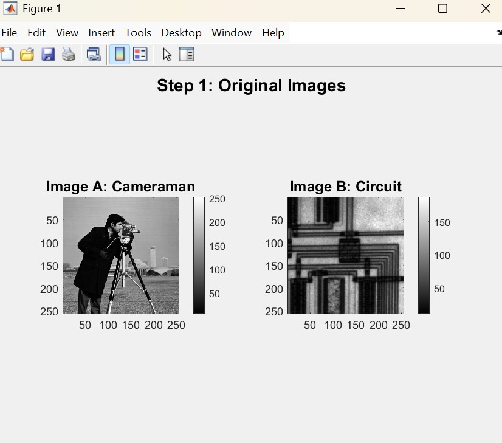
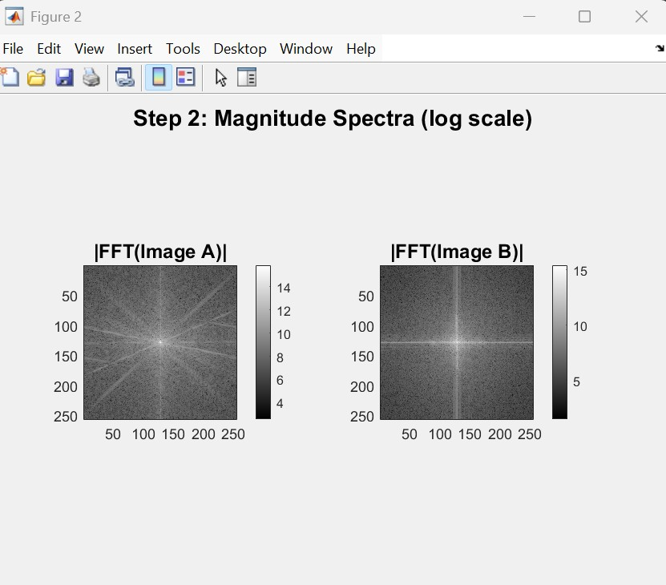
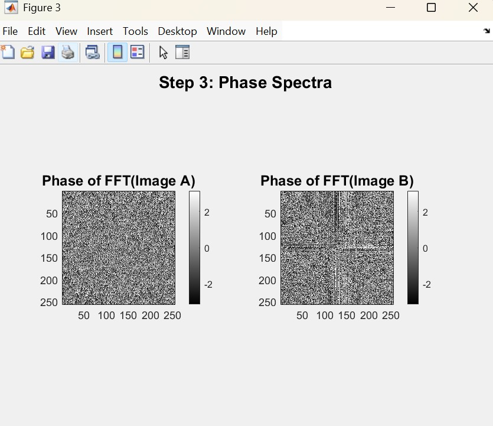
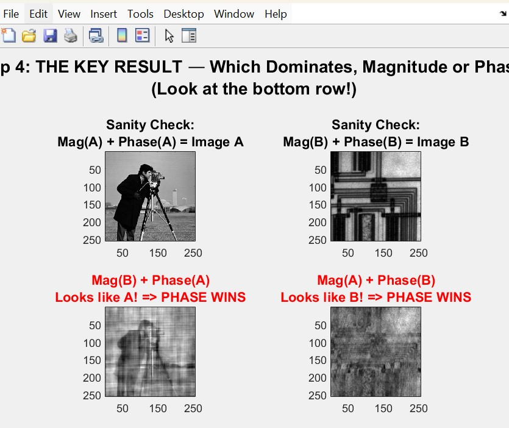

# Fourier Transform: Magnitude vs Phase in Images

This project demonstrates one of the most important results in image processing:
**the phase component of the Fourier transform carries far more perceptual information than the magnitude component.**

We prove this by swapping the magnitude and phase between two different images and observing which component determines what we "see."

---

## Table of Contents

- [Background Theory](#background-theory)
- [Project Files](#project-files)
- [Step-by-Step Walkthrough](#step-by-step-walkthrough)
  - [Step 1: Load the Original Images](#step-1-load-the-original-images)
  - [Step 2: Compute the Magnitude Spectra](#step-2-compute-the-magnitude-spectra)
  - [Step 3: Compute the Phase Spectra](#step-3-compute-the-phase-spectra)
  - [Step 4: The Key Experiment — Swap and Reconstruct](#step-4-the-key-experiment--swap-and-reconstruct)
- [How to Run](#how-to-run)
- [Conclusion](#conclusion)

---

## Background Theory

The **2D Discrete Fourier Transform (DFT)** decomposes an image into a sum of 2D sinusoidal patterns at different frequencies. Each frequency component is a complex number with two parts:

```
X(u,v) = |X(u,v)| * exp(j * angle(X(u,v)))
          --------         ----------------
          MAGNITUDE              PHASE
```

| Component     | What it encodes                                      |
|---------------|------------------------------------------------------|
| **Magnitude** | The *strength* (amplitude/energy) of each frequency — controls contrast and brightness distribution |
| **Phase**     | The *position* (alignment/shift) of each frequency — controls edges, shapes, textures, and spatial structure |

The central question this project answers:

> **If you could only keep one — magnitude or phase — which one preserves the image you recognize?**

---

## Project Files

| File | Description |
|------|-------------|
| `magnitude_phase_replace.m` | Main script — performs the magnitude/phase swap experiment on two images |
| `Fourier_Signal.m` | Supplementary script — demonstrates 1D Fourier analysis on a composite signal (25 Hz + 50 Hz + 175 Hz) |

---

## Step-by-Step Walkthrough

### Step 1: Load the Original Images

We load two standard grayscale test images that ship with MATLAB:

- **Image A**: `cameraman.tif` (256 x 256) — a man with a camera on a tripod
- **Image B**: `circuit.tif` (cropped to 256 x 256) — a printed circuit board

Both are converted to `double` precision (required for FFT) and cropped to the same dimensions (required for swapping frequency components).

```matlab
imageA = double(imread('cameraman.tif'));   % 256x256
imageB = double(imread('circuit.tif'));
imageB = imageB(1:256, 1:256);              % crop to match
```



*Left: Image A (Cameraman) — Right: Image B (Circuit). These two images look completely different, which makes the swap experiment very convincing.*

---

### Step 2: Compute the Magnitude Spectra

We compute the 2D FFT of each image and extract the **magnitude** using `abs()`. The magnitude spectrum is displayed in **log scale** (`log(1 + |X|)`) because the DC component (center) is orders of magnitude larger than the high-frequency components — without log scaling you'd just see a bright dot.

```matlab
fftA = fft2(imageA);
fftB = fft2(imageB);
magA = abs(fftA);       % |X(u,v)| = sqrt(real^2 + imag^2)
magB = abs(fftB);
```

`fftshift()` is used to move the zero-frequency (DC) component to the center of the image for easier visualization.



*The magnitude spectra show the energy distribution across frequencies. The bright center is the DC (average brightness) component. The lines/patterns radiating outward correspond to dominant edges and textures in each image. Notice how the circuit image has strong horizontal and vertical lines in its spectrum — matching its grid-like structure.*

---

### Step 3: Compute the Phase Spectra

We extract the **phase** using `angle()`, which computes `atan2(imag, real)` for each frequency component. Phase values range from **-pi to +pi** radians.

```matlab
phaseA = angle(fftA);   % angle(X(u,v)) in radians
phaseB = angle(fftB);
```



*Phase spectra look like random noise to the human eye. This is deceiving — they actually contain all the structural information (edges, shapes, positions) that makes you recognize an image. If you look carefully at Image B's phase (right), you can faintly see the grid structure of the circuit board encoded in the phase pattern.*

---

### Step 4: The Key Experiment — Swap and Reconstruct

This is the heart of the experiment. We create **4 reconstructions** by combining magnitude and phase in different ways:

```matlab
% Reconstruct: X(u,v) = magnitude .* exp(j * phase)

% Sanity checks (should recover originals)
recon1 = real(ifft2(magA .* exp(1i * phaseA)));   % Mag(A) + Phase(A)
recon2 = real(ifft2(magB .* exp(1i * phaseB)));   % Mag(B) + Phase(B)

% THE KEY SWAPS
recon3 = real(ifft2(magB .* exp(1i * phaseA)));   % Mag(B) + Phase(A) --> ???
recon4 = real(ifft2(magA .* exp(1i * phaseB)));   % Mag(A) + Phase(B) --> ???
```

| Reconstruction | Magnitude from | Phase from | Result looks like... |
|----------------|----------------|------------|----------------------|
| Top-Left       | Image A        | Image A    | Image A (sanity check) |
| Top-Right      | Image B        | Image B    | Image B (sanity check) |
| **Bottom-Left**  | **Image B (circuit)** | **Image A (cameraman)** | **Cameraman! PHASE WINS** |
| **Bottom-Right** | **Image A (cameraman)** | **Image B (circuit)** | **Circuit! PHASE WINS** |



*This is the key figure. Look at the bottom row:*
- ***Bottom-left***: *We used the circuit's magnitude but the cameraman's phase — and you can clearly see the **cameraman**, not the circuit.*
- ***Bottom-right***: *We used the cameraman's magnitude but the circuit's phase — and you can clearly see the **circuit**, not the cameraman.*

**In both cases, the image whose PHASE was used dominates the visual appearance.**

---

## How to Run

### Prerequisites

- **MATLAB** (any recent version)
- **Image Processing Toolbox** (for `cameraman.tif` and `circuit.tif` — these are built-in test images)

### Steps

1. Open MATLAB
2. Navigate to this project folder:
   ```matlab
   cd 'c:\Users\user\OneDrive\Documentos\Nathaniel TA 2025_2026'
   ```
3. Run the script:
   ```matlab
   magnitude_phase_replace
   ```
   Or simply open the file and press **F5**
4. **4 figures** will appear:
   - **Figure 1**: Original images side by side
   - **Figure 2**: Magnitude spectra (log scale)
   - **Figure 3**: Phase spectra
   - **Figure 4**: The key reconstruction results (the proof!)
5. Check the **Command Window** for quantitative correlation results that numerically confirm the visual conclusion

### Testing with Your Own Images

To verify this result holds for any pair of images:

```matlab
% Replace these two lines at the top of the script:
imageA = double(imread('your_image_1.png'));
imageB = double(imread('your_image_2.png'));

% If your images are RGB (color), convert to grayscale first:
imageA = double(rgb2gray(imread('your_color_image.png')));
```

Make sure both images have the **same dimensions**, or adjust the cropping line accordingly.

---

## Conclusion

### The Result

| What we swapped | What the result looks like |
|-----------------|---------------------------|
| Replaced magnitude, **kept phase** | Looks like the **phase source** image |
| **Kept magnitude**, replaced phase | Looks like the **phase source** image (the other one!) |

**Phase wins in every case.**

### Why Does Phase Dominate?

- **Phase** encodes the **spatial relationships** between frequency components — where edges are, how textures align, and where objects sit in the image. This is the structural "skeleton" of the image.
- **Magnitude** only encodes how **strong** each frequency is — it controls overall contrast and brightness balance, but not where things are located.

When you look at an image, your visual system primarily relies on **edges and structure** (encoded in phase) rather than contrast levels (encoded in magnitude). That's why swapping magnitude barely changes what you perceive, while swapping phase completely changes the image's identity.

### Analogy

Think of it like music:
- **Magnitude** is like the volume of each note
- **Phase** is like the timing/rhythm of each note

If you play a song with the correct rhythm but wrong volumes, you still recognize the song. If you play it with correct volumes but scrambled timing, it becomes unrecognizable noise.

---

## Bonus: 1D Fourier Analysis (`Fourier_Signal.m`)

The `Fourier_Signal.m` script demonstrates 1D Fourier analysis on a composite signal:

```matlab
x(t) = 5*cos(2*pi*25*t) + 2*cos(2*pi*50*t) + 3*sin(2*pi*175*t)
```

This signal contains three frequency components (25 Hz, 50 Hz, and 175 Hz). The script computes the FFT and plots the power spectrum, showing three clear peaks at those frequencies. This serves as a simpler 1D introduction to the Fourier transform before moving to the 2D image case.

---

*Project for TA 2025-2026 — Fourier Transform and Signal Processing*
